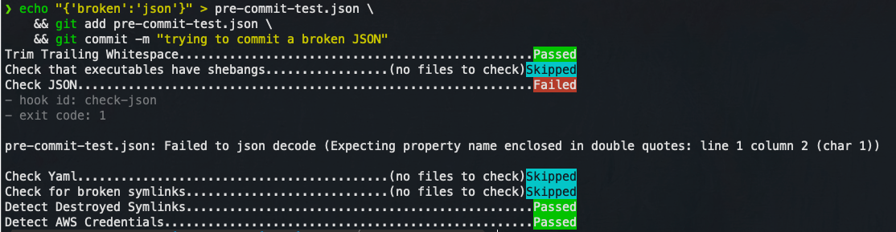
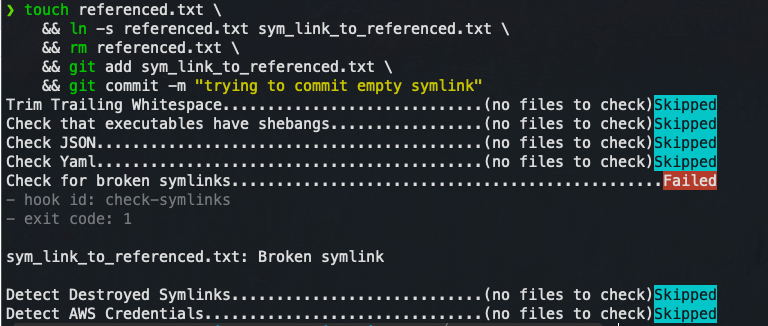

# kloian-pre-commits
This repository introduces Kloian [pre-commit](https://github.com/pre-commit/pre-commit) configuration. 

## Why [pre-commit](https://pre-commit.com/)?

Pre-commit is a framework for managing and maintaining multi-language pre-commit hooks.

**Benefits**
- Centrally managed pre-commit hooks configuration across repositories
- 3rd party hooks can be added easily
- Extensibility - allows creation of pre-commit hooks on high level programming languages e.g. Python
## Installation
1. You need to install pre-commit tool in your machine first. 
2. Then you need to install kloian configuration of pre-commit on one of your git repositories. 

### 1) [pre-commit](https://pre-commit.com/) Installation


#### with homebrew
`brew install pre-commit`

#### with pip

`pip install pre-commit`


#### Check the installation

`pre-commit --version`

### 2) Install Kloian configuration on your git repository

1. Open up your git repositories root directory in a terminal.

2. Run below script to get the kloianway pre-commit configuration.
    ```bash
    # check if you are in the git root directory 
    if test -d .git; then 
        curl -Ls https://raw.githubusercontent.com/kloia/kloian-pre-commits/main/.pre-commit-config.yaml --output .pre-commit-config.yaml;
        pre-commit install --install-hooks --overwrite; 
    else echo "No GIT repository found. Are you sure you are in the root .git directory?"; 
    fi
    ```
3. **[OPTIONAL]** Append pre-commit configuraton file to `.gitignore`
    ```bash
    echo ".pre-commit-config.yaml" >> .gitignore
    ```

## Hook Configurations
| Name | Explanation | 
|--|--| 
| trailing-whitespace | Removes trailing whitespaces on committed files| 
| check-executables-have-shebangs | Checks for `#!/bin/bash` in the first line of script shells| 
| check-json | Checks `.json` file syntax | 
| check-yaml | Checks `.yaml` file syntax | 
| check-symlinks | Detects empty symlinks | 
| destroyed-symlinks | Detects broken symlinks | 
| detect-aws-credentials | Detects _your_ AWS credentials on committed files if they're on your `.aws/credentials` file | 

## Tests
### 1. try to commit a broken JSON file

```bash
echo "{'broken':'json'}" > pre-commit-test.json \
    && git add pre-commit-test.json \
    && git commit -m "trying to commit a broken JSON"
```


### 2. try to commit a  broken symlink
```bash
touch referenced.txt \
    && ln -s referenced.txt sym_link_to_referenced.txt \
    && rm referenced.txt \
    && git add sym_link_to_referenced.txt \
    && git commit -m "trying to commit empty symlink"
```


## Possible Future Custom Hooks
|Name|Explanation|
|--|--|
|detect-any-aws-credential|Checks for any AWS credentials in committed files whether it's in your `.aws/credentials` file or not. |